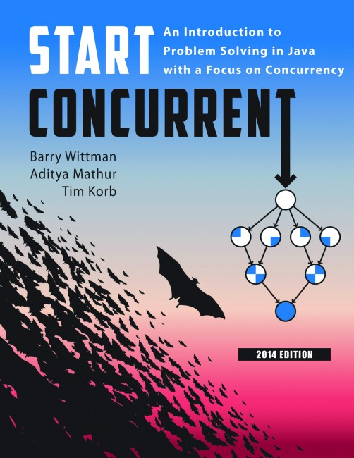
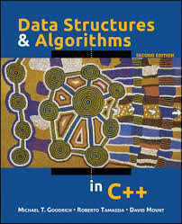
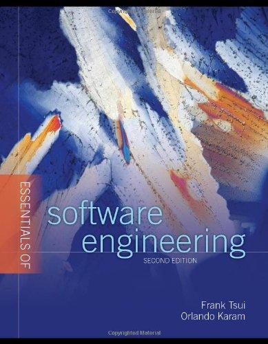
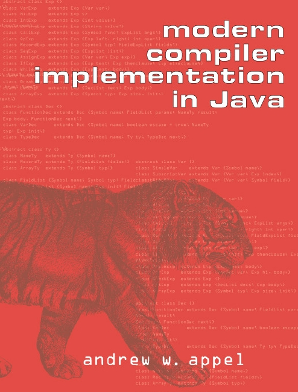
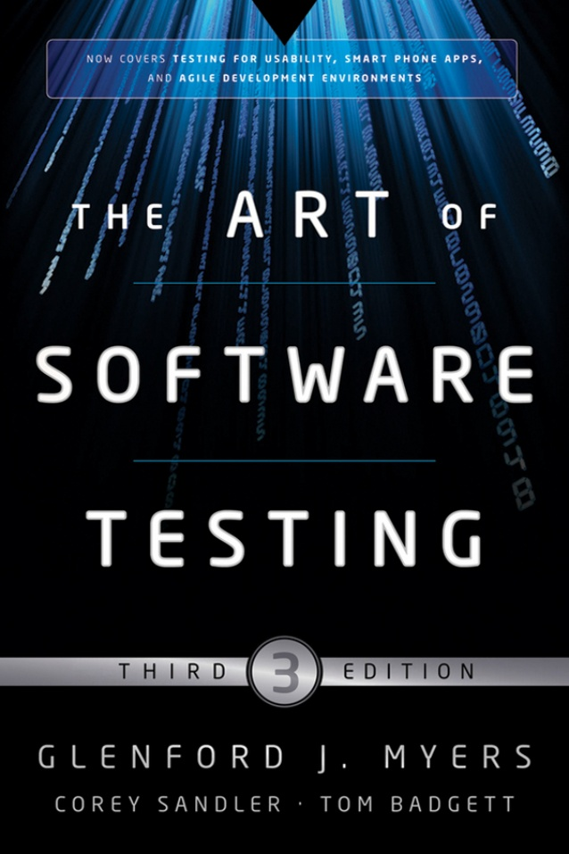
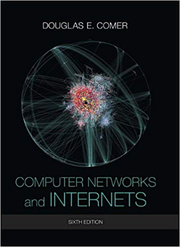
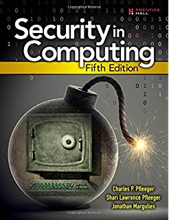

# 📚 Computer Science Academic Notes


- ***To Be Updated***
```
    - Assignments (Project, Homework)
    - Lecture notes
    - Policy & License
```

---

### Bio

Jiho Choi

- B.S. in Computer Science, Purdue University, West Lafayette, IN, USA, 2013 - 2017
- Concentrations
  - `Systems`
  - `Software Engineering`
  - `Computational Science & Engineering`
- Individual Research (Undergraduate Research)
  - `Distributed Systems`, `Cloud Computing Security`
- Teaching Assistant
  - `Computer Architecture`

---


### Courses

**Computer Science**

| Course   | Title                                                  | Keywords                                            |
| -------- | ------------------------------------------------------ | --------------------------------------------------- |
| `CS180`  | Problem Solving and Object-Oriented Programing         | `JAVA` `OOP`                                        |
| `CS182`  | Foundations of Computer Science - Discrete Mathematics | `Discrete Math`                                     |
| `CS190`  | Tools / Leaning Community                              | `Version Control` `Debugging`                       |
|          |                                                        |                                                     |
| `CS240`  | Programming In C                                       | `C/C++`                                             |
| `CS250`  | Computer Architecture                                  | `Computer Architecture` `Computer Organization`     |
| `CS251`  | Data Structures and Algorithms                         | `Data Structure`                                    |
| `CS252`  | Systems Programming                                    | `Intro to Systems` `OS/Compiler/Network` `Lisp`     |
|          |                                                        |                                                     |
| `CS307`  | Software Engineering I                                 | `Design Pattern` `Workflow` `Agile` `Documentation` |
| `CS314`  | Numerical Methods                                      | `Numerical Analysis`                                |
| `CS352`  | **Compilers: Principles And Practice**                 | `Compiler` `MiniScala`                              |
| `CS354`  | **Operating Systems**                                  | `OS` `XINU`                                         |
| `CS381`  | **Introduction to The Analysis Of Algorithms**         | `Algorithm` `CLRS`                                  |
| `CS390`  | Cloud Computing Security                               | `Distributed Systems` `Apache Storm`                |
| `CS390`  | Competitive Programing I                               | `ICPC` `HackerRank`                                 |
|          |                                                        |                                                     |
| `CS408`  | Software Testing                                       | `Testing` `QA` `Continuous Integration`             |
| `CS422`  | Computer Networks                                      | `Network` `OSI` `Torrent`                           |
| `CS426`  | Computer Security                                      | `Software Security` `Network Security`              |
| `CS448`  | Introduction to Relational Database Systems            | `Database` `Apache Hadoop`                          |


**Mathematics / Statistics**

| Course    | Title                           |
| --------- | ------------------------------- |
| `MA261`   | Multivariate Calculus           |
| `MA265`   | Linear Algebra                  |
| `MA266`   | Ordinary Differential Equations |
| `STAT350` | Introduction to Statistics      |


### Course Flowchart

> 


### Textbooks

|     |     |     |     |     |
| :-: | :-: | :-: | :-: | :-: |
|     |     |     |     |     |
|  |  |  |  |  |
|     |     |     |     |     |
|     |     |     |     |     |
| 251 | 251 | 252 | 252 | 307 |
|  |  |  |  |  |
|     |     |     |     |     |
|     |     |     |     |     |
| 314 | 352 | 354 | 354 | 381 |
|  |  |  |  |  |
|     |     |     |     |     |
|     |     |     |     |     |
| 408 | 422 | 422 | 426 | 448 |
|  |  |  |  |  |


[0]: https://github.com/JihoChoi